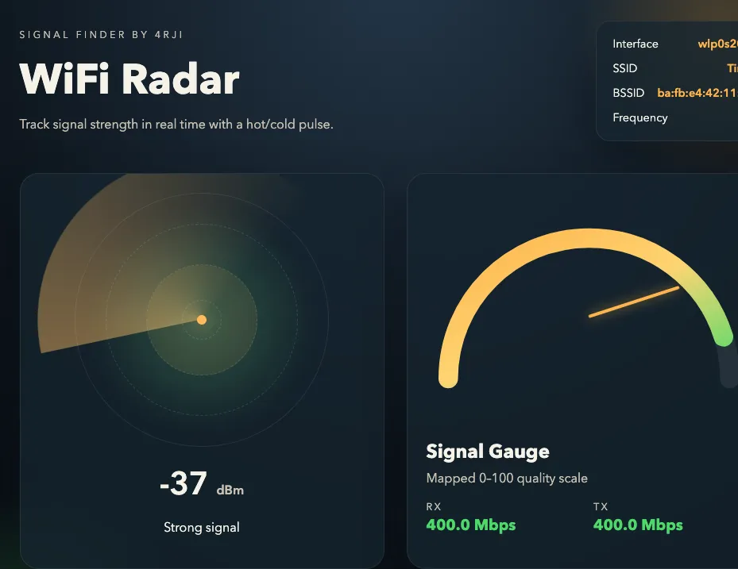

# WiFi Radar (Go)

Minimal MVP that scans Wi-Fi signal levels via `iw`, exposes an HTTP API + SSE, and renders a small radar/gauge UI.



## Run (scan mode, default)

```bash
go run .

or

go run . scan --if wlp0s20f3 --interval 500ms --listen 0.0.0.0:8888
```

When run without a function, the CLI shows a menu so you can choose `scan` or `metrics`. In scan mode, it scans available networks and prompts you to pick one. The app then keeps scanning and tracks that network's RSSI without connecting. RX/TX rates are not available in scan mode.

The CLI prints the available functions at startup. You can also pass a function directly, such as `go run . scan` or `go run . metrics`. The aliases `metric`, `metrix`, and `link` also start metrics mode. Use `--help` to show the same function list with all flags.

You can skip the prompt:

```bash
go run . scan --if wlp0s20f3 --ssid "MyWiFi"
```

or:

```bash
go run . scan --if wlp0s20f3 --bssid aa:bb:cc:dd:ee:ff
```

## Run (link mode)

If you are connected and want link metrics (RX/TX), use:

```bash
go run . metrics --if wlp0s20f3
```

## Notes

- `iw dev <if> scan` often requires elevated permissions (CAP_NET_ADMIN or sudo).
- Use `metrics` or `--mode link` for the previous link-metrics behavior.
- If you run the binary from outside the repo and see 404s, set `WIFI_RADAR_STATIC_DIR` to the `web/static` folder.

## Endpoints

- `GET /api/status`
- `GET /api/best`
- `GET /api/stream` (SSE)
